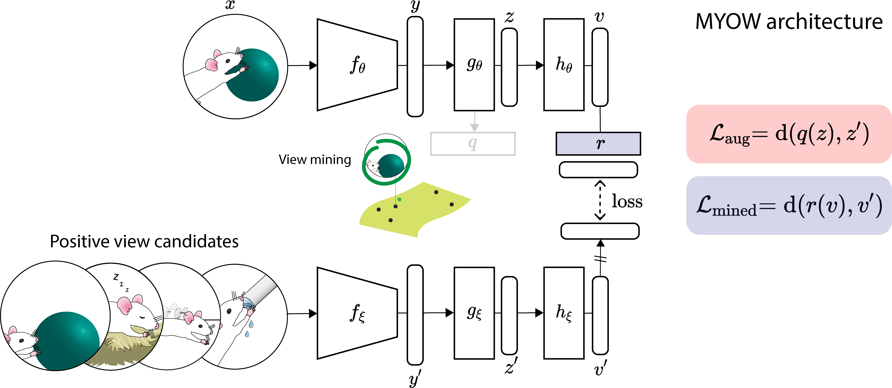

# MYOW - Representation Learning of neural activity

[](https://arxiv.org/abs/2102.10106)
[](./notebooks)
[](https://nerdslab.github.io/myow/)

PyTorch implementation of 
[Mine Your Own vieW: Self-Supervised Learning Through Across-Sample Prediction](https://arxiv.org/abs/2102.10106) 
for neural datasets.



## Setup
To set up a Python virtual environment with the required dependencies, run:
```
python3 -m venv myow_env
source myow_env/bin/activate
pip install --upgrade pip
```

Follow instructions to install 
[PyTorch 1.9.1](https://pytorch.org/get-started/locally/) and 
[PyTorch Geometric](https://pytorch-geometric.readthedocs.io/en/latest/notes/installation.html):
```
pip install torch==1.9.1+cu111 -f https://download.pytorch.org/whl/torch_stable.html
pip install torch-scatter torch-sparse torch-cluster torch-spline-conv torch-geometric -f https://data.pyg.org/whl/torch-1.9.0+cu111.html
pip install -r requirements.txt
export PYTHONPATH=$PYTHONPATH:$PWD
```

## :monkey: Decoding movements from the primate brain
`notebooks/train_monkey.ipynb` provides a thorough walk-through including data preparation, 
neural augmentations and the MYOW architecture.

**Dataset** Four datasets [[1]](#1) were collected from two macaques, Mihi and Chewie, 
over two days for each individual. 
The data is made available in `data/mihi-chewie`.

| Primate | Day        | Day index | # of trials | # of neurons |
|---------|------------|:---------:|:-----------:|:------------:|
| Mihi    | 03/03/2014 |     1     |     209     |      187     |
| Mihi    | 03/06/2014 |     2     |     215     |      172     |
| Chewie  | 10/03/2013 |     1     |     159     |      174     |
| Chewie  | 12/19/2013 |     2     |     180     |      155     |

<a id="1">[1]</a>
Dyer, E.L., Gheshlaghi Azar, M., Perich, M.G. et al.
A cryptography-based approach for movement decoding.
Nat Biomed Eng 1, 967–976 (2017).

**Pretraining** Run the following command to pre-train with MYOW on one of the datasets:
```bash
python3 train_monkey.py --root=./data/mihi-chewie --primate="chewie" --day=1
```
The subject and recording day can be specified through `primate` and `day`.
Try `--help` to get a list of all flags.

**Evaluation** We fit a linear layer on top of 
the frozen representation to assess the decodability of reach direction
from the learned neural representation. 
Evaluation is triggered every few epochs and will 
not back-propagate any gradient to the encoder.

Al panoply of metrics is logged to tensorboard. The learned representations are also logged and can be visualized using the 
embedding projector.
To start the tensorboard server run the following command:
```
tensorboard --logdir=./runs
```

## :mouse: Decoding arousal states from the rodent brain during free behavior
**Dataset** Two datasets [[2]](#2) were collected from two rodents in different brain regions. 
The data is made available in `data/rodent`.

| Rodent | Brain region | Length of recording | # of neurons |
|--------|--------------|:-------------------:|:------------:|
| Rat    | V1           |         12h         |     120      |
| Mouse  | CA1          |         12h         |      40      |

<a id="2">[2]</a>
Ma, Z., Turrigiano, G.G., Wessel, R., Hengen, K.B. Cortical circuit dynamics are homeostatically tuned
to criticality in vivo. Neuron, 2019.

**Pretraining** Run the following command to pre-train with MYOW on one of the datasets:
```bash
python3 train_mouse.py --root=./data/rodent --rodent="mouse"
```
The rodent can be specified through `rodent`. 
Try `--help` to get a list of all flags.

**Evaluation** We fit a linear layer on top of 
the frozen representation to assess the decodability of arousal state (Awake, REM, nREM)
from the learned neural representation. 
Evaluation is triggered every few epochs and will 
not back-propagate any gradient to the encoder.

## :cat: Running MYOW on a custom dataset
To use MYOW for pre-training on a custom dataset, follow these [instructions](docs/custom_dataset.md) 
to prepare your data. This should also provide an inside look of how we handle view generation in an effective way.

## Contributors

* Mehdi Azabou (Maintainer), github: [mazabou](https://github.com/mazabou)
* Carolina Urzay, github: [](.)
* Ran Liu, github: [ranliu98](https://github.com/ranliu98)

## Citation
If you find the code useful for your research, please consider citing our work:

```
@misc{azabou2021view,
      title={Mine Your Own vieW: Self-Supervised Learning Through Across-Sample Prediction}, 
      author={Mehdi Azabou and Mohammad Gheshlaghi Azar and Ran Liu and Chi-Heng Lin and Erik C. Johnson 
              and Kiran Bhaskaran-Nair and Max Dabagia and Bernardo Avila-Pires and Lindsey Kitchell 
              and Keith B. Hengen and William Gray-Roncal and Michal Valko and Eva L. Dyer},
      year={2021},
      eprint={2102.10106},
      archivePrefix={arXiv},
      primaryClass={cs.LG},
      url = {https://arxiv.org/abs/2102.10106}}
```
