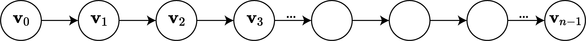

# Preparing a custom dataset for pre-training with MYOW

To understand the reasoning behind some of the design choices that were made, 
we will quickly go over the type of operations that we needed to perform with MYOW.

### View augmentation and view mining
In MYOW, we use two types of views, augmented views and mined views. Given an anchor sample,
we can generate:
- An augmented view: in addition to applying neural augmentations, like randomized dropout, 
we consider nearby samples (highlighted in red) to be positive views of the anchor example. 
- A mined view: during minning, we look for other samples in the datasets that are _similar_ 
to the anchor sample. we need however to only consider _distant_ samples (highlighted in blue) 
as candidates for mining, as nearby samples which are natural positive views of the anchor sample 
would be selected otherwise, when more distant views can bring better diversity to the learning.


Given this, we need to be able to easily access the candidates for both augmented and mined views
of a particular anchor sample, and this in the context of mini-batch training, 
and with minimal computational overhead.

### Graph representation
We will use a graph representation to represent the sequential data. 
The first advantage of such representation is that we can encode multiple 
sequences of varying lengths.
We will use the PyTorch geometric package, which provides a simple implementation of a graph. 

A dataset $\mathcal{D}$ will be a collection of sequences of varying lengths. Let any sequence 
of any length $n$ be ($\mathbf{v}_0, \cdots, \mathbf{v}_{n-1}$), 
where $\mathbf{v}_i \in \mathbb{R}^d$ is the firing rate vector of $d$ neurons for example.

The sequence can be represented as the following chain graph:



For each sequence, we will define an object `data` which will hold the following attributes:
- `data.x`: Node feature matrix with shape [sequence_length, num_neurons]
- `data.edge_index` (optional): Graph connectivity in COO format with shape [2, num_edges] and type `torch.long`
- other attributes can be added to the graph if needed, as long as the attribute matrix respects the shape [sequence_length, ?] 

**Step 1**: Transform each individual sequence into a graph using `torch_geometric.data.Data`.

```python
# Example
import torch
from torch_geometric.data import Data

firing_rates = torch.rand((12, 40)) 
data = Data(x=firing_rates)
```

**Step 2**: Combine all your new sequence graphs into a dataset object, that returns the different sequences.
```python
# Example
class Dataset:
    def __init__(self, data_list):
        self.data_list = data_list
        
    def __getitem__(self, item):
        return self.data_list[item]
    
    def __len__(self):
        return len(self.data_list)
```

- The monkey dataset is composed of trial-based recordings, 
so the dataset will return one of the trial sequences when indexed.
- The rodent dataset only has one long sequence (12-hour recording), so the dataset will be of length one.

**Step 3**: Select one of the two available dataloaders and you are done. Everything is taken care of under the hood. 
Your choice of dataloader will depend on the mining strategy, which is explained next.

Refer to the PyTorch geometric [documentation](https://pytorch-geometric.readthedocs.io/en/latest/notes/introduction.html#mini-batches) 
for more details about graph batching.

### DataLoaders
We model pair-wise relationships between nodes (or elements in the sequence), by introducing two types
of edges.

#### Positive edges
First, positive edges are added between every node and the neighboring nodes 
that can act as their positive views. This is illustrated below, for the highlighted node.


When generating the augmented view for a given sample, one of these edges is randomly sampled and 
the corresponding neighbor is used as the augmented view. 

The **positivity range** can be specified through `pos_kmin` and `pos_kmax` in both `RelativePositioningDataLoader` 
and `RelativeSequenceDataLoader`. For a given node `t`,
_positive_ edges will be added between `t` and any node between `t + pos_kmin` and `t + pos_kmax`. 
In the illustration bellow, we have `pos_kmin=-2` and `pos_kmax=2`.

#### Non-mining candidate edges

Adding an edge between a node and its possible mining candidate would be overkill, we are trying 
to mine outside of a defined window around the anchor sample, which means that there way more 
candidates than non-condidates. Thus, we will add define non-mining candidate edges, where we specify
which node pairs not to consider as mining candidates for each other.

We add _non-mining candidate_ edges between nodes that shouldn't be mining candidates of each other.
As shown below, there are two different strategies:
1. We never mine for views in the anchor sample's own sequence. This would be used in trial-based datasets, 
like the monkey datasets, where we mine for views in other trials. In this case use `RelativeSequenceDataLoader`,
no further parameters need to be specified.
2. We define a negative range outside which we can mine. By default, we will be able to mine 
in other sequences as well. We use this in the rodent datasets, where we have very long recordings.
In this case, use `RelativePositioningDataLoader` and specify the range using `neg_k`. 


#### DataLoader arguments
`RelativePositioningDataLoader` and `RelativeSequenceDataLoader` take care of modeling and building
the _view graphs_. But they also act as regular dataloaders. You can pass in the same arguments, that 
a regular PyTorch DataLoader would require, like `batch_size` or `drop_last`.

These dataloaders also accept a `transform` function, which will be applied as needed when generating the views. Note
that the views will be augmented independently.
